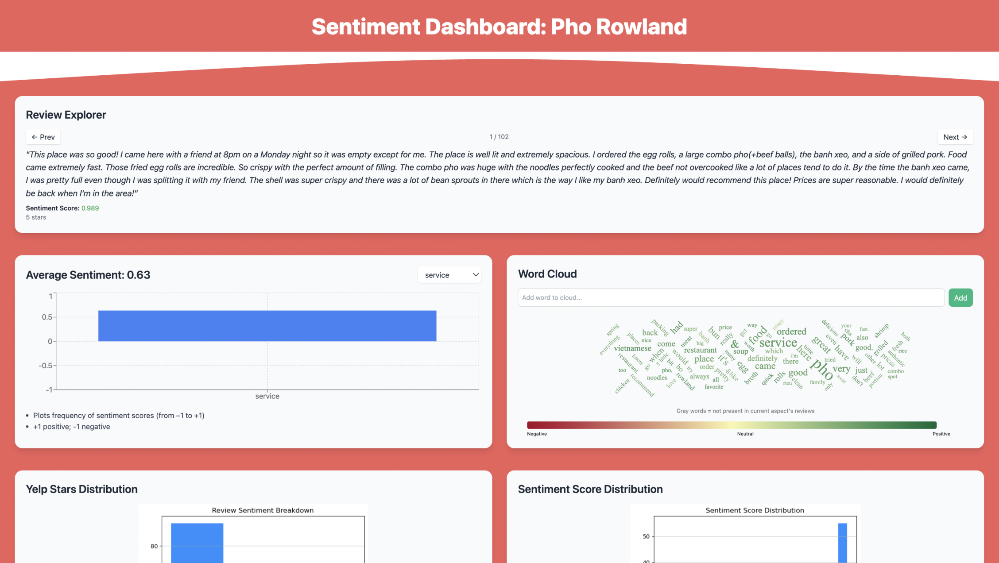

## ShowsSentiments
Sentiment analysis of Pho Rowland, a friend's successful restaurant's Yelp reviews with VADER, aspect‑based scoring, and interactive visualizations

– End‐to‐end sentiment‐analysis pipeline for Pho Rowland’s Yelp reviews. 
– scrapes Yelp review text, computes overall and sentence‐level sentiment with VADER
– performs aspect‐based sentiment extraction (food, service, price, etc)
– dashboard of interactive plots (violin‐plots, bubble charts, co‐occurrence maps)
=> For actionable insights

## Preview:

## Tools Used
- Python (Jupyter Notebook)
- VADER Sentiment
- NRC Emotion Lexicon
- Dash / Altair for Visualization
- Selenium (for scraping)

## Files
- `sentiment_analysis.ipynb`: Main analysis
- `scraper.py`: Pulls reviews from Yelp
- `requirements.txt`: Dependencies
