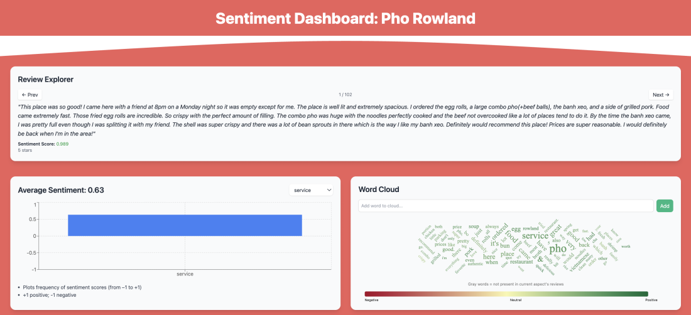
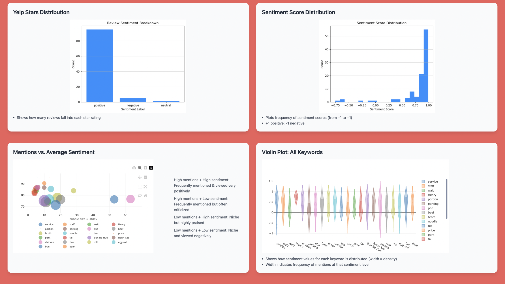

## ShowsSentiments
Sentiment analysis of Pho Rowland, a friend's successful restaurant's Yelp reviews with VADER, aspect‑based scoring, and interactive visualizations

- End‐to‐end sentiment‐analysis pipeline for Pho Rowland’s Yelp reviews. 
- scrapes Yelp review text, computes overall and sentence‐level sentiment with VADER
- performs aspect‐based sentiment extraction (food, service, price, etc)
- dashboard of interactive plots (violin‐plots, bubble charts, co‐occurrence maps)

=> For actionable insights

## Key Findings

- Overall Sentiment is Strongly Positive
  - Most reviews received high sentiment scores and 5-star ratings

- High Praise for Signature Dishes
  - Terms like pho, egg roll, banh xeo, and pork appear frequently and are associated with high sentiment (~ + 0.6)

- Solid Service
  - The service aspect has a high average sentiment, frequently mentioned positively in reviews (especially "Henry" [~ + 0.73])

- Some dishes/items have Low Mention but High Sentiment Items
  - Keywords like tea and bun are niche but receive consistently positive feedback—hidden strengths

- Neglected or Weak Spots are Minimal
  - Few keywords fall in the low sentiment/low mention quadrant, suggesting minimal recurring complaints

## Actionable Takeaways

Because general sentiment is so high, it's paramount to continue what's working. Here are the key parts to keep up:

- Double Down on Best-Sellers
  - Shout the top dishes (pho, egg rolls, banh xeo) from the mountaintops! Do specials, bold them on the menus–– they are tried n' true

- Leverage Service Strength
  - Perhaps salary raise, customers recurringly mention service as part of their positive experience

- Upsell Niche Favorites
  - Same story as the popular items, but these (tea, bun, rice) may be more important to promote; as they likely aren't spread by word-of-mouth as much, but are well-liked

## Preview:

Live Demo: [shows-sentiments.vercel.app](https://shows-sentiments.vercel.app)

## Tools Used
- **React** – Interactive frontend dashboard
- **Tailwind CSS** – Component styling and layout
- **Plotly.js** – Violin plots and bubble charts
- **Recharts** – Bar chart visualizations
- **Framer Motion** – UI transitions
- **Vercel** – Frontend deployment
- **PapaParse** – Client-side CSV parsing
- **Python** (Jupyter Notebook) – Sentiment and aspect analysis
- **VADER Sentiment** – Review-level sentiment scoring
- **NRC Emotion Lexicon** – Fine-grained emotional scoring
- **Selenium** – Initial data scraping
- **Altair / Dash** – Early prototyping and validation

## Files
- `SentimentAnalysisPlayground.ipynb` – Core NLP analysis in Python (VADER, aspect scoring)
- `cleaned_sentiment.csv` – Output of cleaned, structured sentiment data for dashboard
- `scraper.py` – Yelp review scraper using Selenium (run locally)
- `requirements.txt` – Python dependencies (for analysis and scraping)
- `src/` – React components for the dashboard (charts, word cloud, explorer, etc.)
- `public/` – Static assets (e.g., images, sentiment visuals)
- `package.json` – Frontend dependencies and build instructions
- `.vercelignore` – Ensures Python files don't interfere with Vercel deployment
- `tailwind.config.js` / `postcss.config.js` – Tailwind setup
